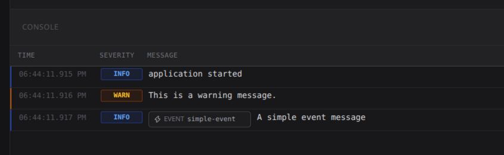

# LogMate TypeScript Client

<div align="center">
  
</div>

The official TypeScript and Node.js client for sending application logs,
metadata, and events to LogMate.

[Back to all clients](../README.md) ·
[Source](.) ·
[Example](./examples/main.ts) ·
[npm](https://www.npmjs.com/package/@loghill-oss/logmate-client)

## What the TypeScript client does

`instrument()` returns one process-wide logger whose behavior follows the
Python and Go clients. TypeScript awaits instrumentation because Node HTTP is
asynchronous; the promise resolves only after the initial connection and its
configured retries finish.

It can:

- send `DEBUG`, `INFO`, `WARN`, `ERROR`, and `FATAL` records;
- attach JSON-compatible metadata and event fields;
- capture complete stdout, stderr, and stdin lines;
- observe uncaught exceptions without replacing Node's crash behavior;
- persist pending records with Node's built-in SQLite implementation;
- retry temporary failures and report process health;
- continue as a local logger when no server is configured.

## Download and install

The package requires Node.js 22.13 or newer and includes its TypeScript types.
It has no runtime npm dependencies and no native addon to compile.

Install the production release selected by npm's `latest` tag:

```sh
npm install @loghill-oss/logmate-client
```

Install a specific production version:

```sh
npm install @loghill-oss/logmate-client@0.1.0
```

Install the current staging/prerelease build selected by `next`:

```sh
npm install @loghill-oss/logmate-client@next
```

You can also install an exact prerelease such as:

```sh
npm install @loghill-oss/logmate-client@0.2.0-rc.12345
```

Unlike Python, npm has no separate TestPyPI-style registry for this workflow.
Prerelease versions live in the normal npm registry, while the `next` dist-tag
keeps them separate from the default `latest` install channel.

## Quick start

This is the complete example from
[`examples/main.ts`](./examples/main.ts):

```ts
import { instrument } from "@loghill-oss/logmate-client";

const logger = await instrument({
  apiUrl: "http://localhost:8080",
  senderName: "logmate-client-typescript-example",
});

try {
  // Log an info message with metadata
  logger.info("application started", {
    metadata: { environment: "development" },
  });

  // Log a warning message
  logger.warning("This is a warning message.");

  // Log with an event name
  logger.info("A simple event message", {
    event: "simple-event",
  });
} finally {
  await logger.close();
}
```

Run the repository example locally:

```sh
cd logmate-client-ts
npm install
npm run example
```

After the server accepts the instance, the client prints
`[LogMate] Initialized successfully!`. Application logs therefore appear after
the initialization message, just as they do in Python and Go.

Terminal output has the same compact format:

```text
2026-09-08 02:55:08 [INFO    ] application started
2026-09-08 02:55:08 [WARNING ] This is a warning message.
```

### Expected result

The example sends one structured `INFO` record, one `WARN` record, and one
`INFO` record associated with `simple-event`:



## Configuration

### Use a `.env` file

Create `.env` in the application's working directory:

```dotenv
LOGMATE_API_URL=http://localhost:8080
LOGMATE_SENDER_NAME=checkout-api
```

Then instrument without connection arguments:

```ts
import { instrument } from "@loghill-oss/logmate-client";

const logger = await instrument();
logger.info("Application started");
```

When supplied as options, `apiUrl` and `senderName` must be supplied together.
Environment values take precedence over explicit options. The sender name must
contain between 1 and 80 characters.

### Main options

```ts
const logger = await instrument({
  name: "logmate",
  apiUrl: "http://localhost:8080",
  senderName: "checkout-api",
  envFile: ".env",
  level: "DEBUG",
  console: true,
  healthcheckInterval: 60,
  timeout: 10,
  retryAttempts: 3,
  retryInterval: 5,
  queueFile: undefined,
  disablePersistence: false,
  captureSystemLogs: true,
  captureStdin: true,
  shutdownFlushTimeout: 2,
});
```

| Option | Default | Purpose |
| --- | --- | --- |
| `name` | `logmate` | Logger name and fallback sender name. |
| `apiUrl` | `LOGMATE_API_URL` | Base URL of the LogMate server. |
| `senderName` | `LOGMATE_SENDER_NAME` | Sender shown in the dashboard. |
| `envFile` | working-directory `.env` | Explicit environment file path. |
| `level` | `DEBUG` | Minimum local log level. |
| `console` | `true` | Keep formatted logs visible in the terminal. |
| `healthcheckInterval` | `60` seconds | Interval between instance health signals. |
| `timeout` | `10` seconds | HTTP request timeout. |
| `retryAttempts` | `3` | Retries after the first connection/delivery attempt. |
| `retryInterval` | `5` seconds | Delay between retries. |
| `queueFile` | generated under `~/.logmate` | SQLite queue location. |
| `disablePersistence` | `false` | Use only an in-memory queue. |
| `captureSystemLogs` | `true` | Capture stdout and stderr. |
| `captureStdin` | `true` | Capture stdin data read by the application. |
| `shutdownFlushTimeout` | `2` seconds | Time allowed to flush during shutdown. |
| `errorHandler` | no-op | Receive internal client errors programmatically. |

`LOGMATE_QUEUE_FILE` overrides the queue path and
`LOGMATE_SHUTDOWN_TIMEOUT_SECONDS` overrides the shutdown timeout.

## Send logs

### Severity methods

```ts
logger.debug("Cache lookup started");
logger.info("Order received");
logger.warning("Provider response is slow");
logger.error("Payment could not be completed");
logger.fatal("Database is unavailable");
```

`fatal()` records a `FATAL` log and does not terminate the application.
`warn()` and `warning()` are equivalent.

### Add metadata

```ts
logger.info("Order received", {
  metadata: {
    order_id: "PED-123",
    region: "sa-east-1",
    amount: 42.5,
  },
});
```

### Trigger an event

```ts
logger.error("Payment declined by provider", {
  event: "payment-failed",
  eventOccurrenceId: "payment-PED-123-attempt-1",
  metadata: {
    order_id: "PED-123",
    provider: "payments",
    reason: "issuer_unavailable",
  },
});
```

Event names accept lowercase letters, numbers, `_`, and `-`, with 3 to 80
characters. `eventOccurrenceId` accepts at most 200 characters. Invalid event
fields are reported and ignored without dropping the record.

### Send an explicit record

```ts
const result = logger.send("Payment queue is above its limit", {
  severity: "WARN",
  event: "queue-backlog",
  metadata: { queue: "payments", size: 850 },
});
```

Accepted severities are `UNDEFINED`, `TRACE`, `DEBUG`, `INFO`, `WARN`, `ERROR`,
and `FATAL`.

### Record a handled exception

```ts
try {
  await processPayment(order);
} catch (error) {
  logger.exception("Payment processing failed", error, {
    event: "payment-failed",
    metadata: { order_id: order.id },
  });
  throw error;
}
```

## Automatic process capture

After a successful or temporarily exhausted initialization, the client captures
complete lines written to `process.stdout` and `process.stderr`. Stdin is
observed when the application consumes data; instrumentation does not force
stdin into flowing mode. Captured lines use `UNDEFINED` and include `captured`
and `source` metadata.

The client uses `uncaughtExceptionMonitor`, so it can queue an uncaught failure
without suppressing Node's normal exception output or exit behavior.

Disable capture when streams may contain passwords, tokens, personal data, or
other secrets:

```ts
const logger = await instrument({
  apiUrl: "http://localhost:8080",
  senderName: "checkout-api",
  captureSystemLogs: false,
  captureStdin: false,
});
```

## Queue, retry, and shutdown

The first connection is attempted immediately. Temporary failures are retried
`retryAttempts` times, with `retryInterval` seconds between attempts. Only then
does `instrument()` resolve into local/queued operation for that run. Permanent
API errors disable remote delivery and preserve already persisted records.

After a successful connection, delivery runs in the background. Temporary
outages keep records in FIFO order and trigger reconnection. Client lifecycle
messages all use the `[LogMate]` prefix, including retries, offline state,
restoration, and successful initialization.

Use `flush()` when a job needs to wait explicitly and always await `close()` on
controlled shutdown:

```ts
await logger.flush(5);
await logger.close();
```

SQLite comes from `node:sqlite`; there is no `node-gyp`, native npm addon, or
external database process.

## Publishing and releases

### One-time npm setup

1. Create or join the npm organization/scope `loghill-oss`.
2. Run `npm login` and enable 2FA as npm requests.
3. From the repository root, run `make typescript-check` and then
   `make typescript-publish` for the first public publication.
4. The first publication is local because npm only lets you attach a trusted
   publisher after the package exists.
5. Configure npm Trusted Publishing for repository
   `loghill-oss/logmate-clients` and workflow `ci-typescript.yml`. Authorize the
   `npm-staging` and `npm` GitHub environments used by the workflow.

### Validate locally

From the repository root:

```sh
make typescript-tools
make typescript-check
```

### Publish staging manually

Publish a unique prerelease under `next`:

```sh
make typescript-publish-staging
```

The Makefile derives the base from `package.json`, generates a version such as
`0.2.0-rc.1781145123456`, and builds it in a temporary directory. It does not
change `package.json`, `package-lock.json`, or the stable build in the working
tree. To choose the prerelease explicitly, use:

```sh
make typescript-publish-staging VERSION=0.2.0-rc.1
```

Consumers opt into it with:

```sh
npm install @loghill-oss/logmate-client@next
```

Each staging merge generates a unique version such as
`0.2.0-rc.<github-run-id>` and publishes it under `next`. It does not change
what plain `npm install @loghill-oss/logmate-client` installs.

npm also has a feature literally called *staged publishing*. That feature holds
an artifact for human approval before it becomes installable; it is not a test
registry or a release channel. This repository uses prerelease SemVer plus the
`next` dist-tag because staging builds need to be installable for validation.

### Publish production manually

Set a new stable version, commit both `package.json` and `package-lock.json`,
then publish:

```sh
make typescript-version VERSION=0.2.0
make typescript-publish
```

Stable versions are published under `latest`. npm versions are immutable, so
the version must be increased before every production publication.

### Automatic branch publication

- A push/merge to `staging` that changes `logmate-client-ts/**` tests only this
  client and publishes a unique prerelease under `next`.
- A push/merge to `main` that changes `logmate-client-ts/**` tests only this
  client and publishes the stable package version under `latest`.
- Changes limited to Python or Go do not start either TypeScript publish job.

An optional GitHub release can be created with a matching tag such as
`logmate-client-ts/v0.2.0`; the npm publication itself is branch-driven.

## License

The TypeScript client is distributed under the repository's
[CPAL 1.0 license](../LICENSE.md).

<div align="center">
  
</div>
